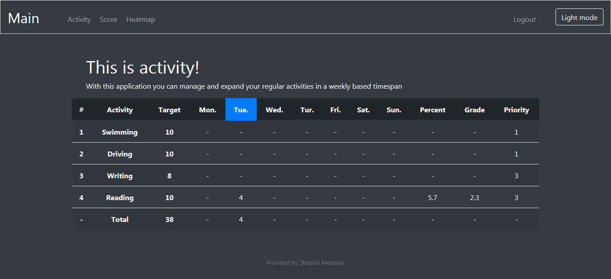
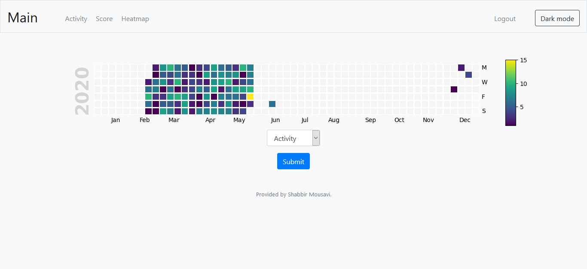

# Welcome to activity!

In this application the user can manage and diversify his/her activities.

The code is in Python, JavaScript, HTML and CSS.

[http://active0.herokuapp.com/](http://active0.herokuapp.com/)

### List of most important tools used in this project are :

* Jinja templates for rendering html page with a back-end context.

* Flask-login for user authentication.

* Flask Blueprint class to separate diffrent app logics. 

* Werkzeug for generating and comparing hashed passwords.

* SQLAlchemy for creating models and storing required data in the database.

* Heroku-postgres for storing data.

* pandas for manipulatind data in dataframe format.

* calplot and Matplotlib to create activity heatmaps.

* JvavaScript for light/dark mode and current date highlight.

### App features:

* __New Activity:__ The user can store a new activity in the database via add_activity.html

* __Activity score:__ The user can store daily scores for each defined activity via add_score.html.

* __Activity heatmap:__ The user can specify a target for total daily score.

* __light/dark mode:__ The user can change app mode.

* __Current date:__ For convenience, the current date is highlighted by blue color.

### App logic:

The week is dynamicly updated based on a 7 day timspan (today and 6 days before.)

Each activity has a daily target score between 0 and 10.

Each day has a total target score > 10.

Therfore to meet a total target score, user should do several activities.

Each activity has a weekly grade and priority. 

For each day that user does not do a specific activity, the activity grade decreases and its priority increases.

### Target score
The user specifies a target for total daily score. 
For example if the total target score is 100, the user should do at least 10 diffrent activities to fulfill the target score.

### Percentage of activity acomplishment
The percentage of activity acomplishment in the week is calulated as the average of the score in the week devided by target score.
100% score means that the activity matched the target score in the 7 day timspan.

### Activity Grade
The activity grade is calculated as (today_score + 7day average score)/2:
The grade has two parts:
Today activity and 7day hisory activity.  
The grade score measures overall activity of the user for today. 
If the activity has a solid history score (7 day average score), then the user can relax the activity for today, 
but if the  history score is low, the user should hit higher daily score for a good daily grade.

### Activity priority
The priority is calculated as (10 - (Target_score-Grade_score) + 1)
In one hand, if the target score is 10 and the grade is zero, then for a target score of 10, activity priority is 1,
meaning that the activity has a high priority for today.
and on the other hand if the grade is 10 for a target score of 10, then priority of the activity is 11, 
meaning  that the activity has a low priority for today,
